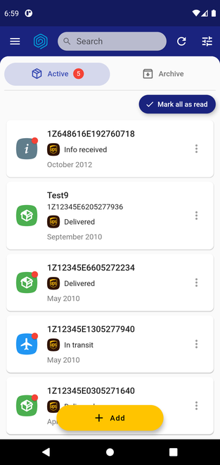
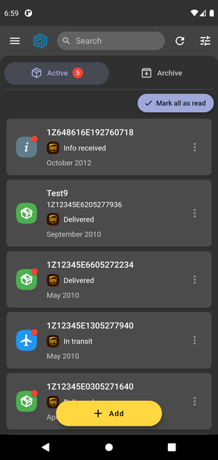
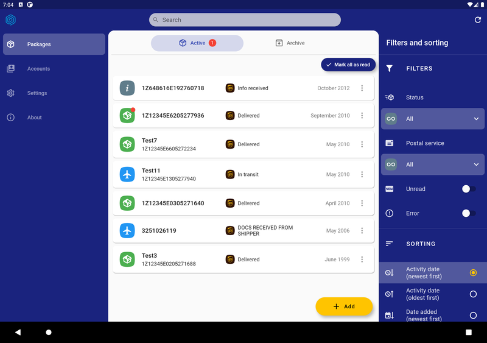
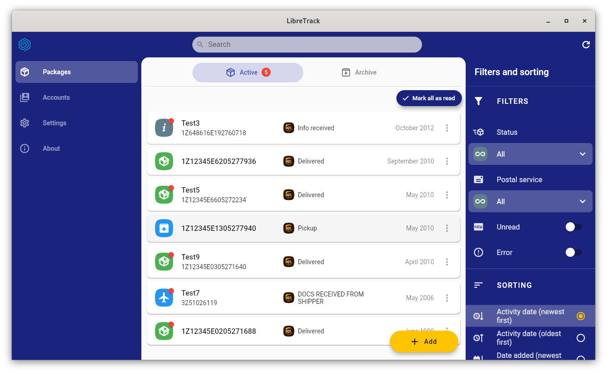

[](https://github.com/proninyaroslav/libretrack/releases)
[](https://matrix.to/#libretrack:matrix.org)
[](https://t.me/LibreTrack)

LibreTrack
=====================


[](https://snapcraft.io/libretrack)
[](https://flathub.org/apps/details/ru.proninyaroslav.libretrack)

[](https://f-droid.org/packages/org.proninyaroslav.libretrack)
[](https://play.google.com/store/apps/details?id=org.proninyaroslav.libretrack)
[](https://github.com/proninyaroslav/libretrack/releases)
[](https://www.androidfilehost.com/?w=files&flid=326398)
[](https://proninyaroslav.ru/ftp/libretrack)

Private, cross-platform package tracking app.

Track postal items directly on your device using accounts of postal services. The app respects your privacy and freedom: you don't use third-party online services.

[Use, see, change and share](https://en.wikipedia.org/wiki/Free_software); [with all](https://en.wikipedia.org/wiki/Copyleft).

## 📋 Features

 - Free and Open Source software (FOSS)
 - Support for various platfroms and devices
 - Support accounts of different carriers
 - Detailed information about the postal items, carriers, tracking history
 - Local push notifications
 - Automatic tracking in the background, and also manual refreshing
 - Ability to add a list of track numbers
 - Filter and sort numbers by activity date, package status, carrier, etc
 - Barcode and QR code scanner for tracking numbers
 - Barcode generator
 - Archiving tracking numbers
 - Material Design 2.0
 - Night theme
 - Responsive UI for different devices form factors
 - [Linux]: System tray support. Note: for support in GNOME, please install [gnome-shell-extension-appindicator](https://extensions.gnome.org/extension/615/appindicator-support/) or similar extension.

## 🖥️💻📱 Available platforms

 - Android
 - Linux
 - ~~iOS~~ (planned)
 - ~~macOS~~ (planned)
 - ~~Web~~ (planned)
 - ~~Windows~~ (planned)

## 📦 Supported postal services

[](https://www.ups.com)
[](https://www.pochta.ru/)

## 🌍 Translations

 - **English**
 - **Itialian** *(thanks albanobattistella)*
 - **Russian**
 - **Spanish** *(thanks sguinetti)*

## 💰 Donation

If you like LibreTrack you can support developer with these methods. If you have problems with payment or you want to donate in another way, contact me: `proninyaroslav@mail.ru`. Thank you!

 - **PayPal**: [](https://www.paypal.com/cgi-bin/webscr?cmd=_s-xclick&hosted_button_id=GWWYZSCKPAB2Q)
 - **Yandex Money (YooMoney)**: `410011738561939`
 - **WebMoney**:
     - **WMZ**: `Z335461926163`
     - **WMR**: `R151579576467`
 - **Amazon.com eGift Cards**: just choose your amount and type e-mail `proninyaroslav@mail.ru`
in the gift card details https://smile.amazon.com/gp/product/B004LLIKVU/
 - **Liberapay**: [](https://liberapay.com/proninyaroslav/donate)
 - **Bitcoin**: `1Af9DgxtWvVp6bFiYQw2MeWtRzTXshRYpB`
 - **Nano**: `nano_1b13t35x5dwu39xcs3xj4ozfsniozfnxdqwjijy6efnkda6sc3hqie914fja`

## ⚙️ Building

To build, you need to install [Flutter](https://flutter.dev/docs/get-started/install).

Enter the following command in the terminal to build the project:
 - **Android APK**
    ```
    flutter build apk --flavor main
    ```
    You can also split APK into different architectures:
    ```
    flutter build apk --flavor main --split-per-abi
    ```
    or
    ```
    flutter build apk --flavor main --target-platform [android-arm|android-arm64|android-x64]
    ```
    The built APK will be located in the `build/app/outputs/flutter-apk/` directory.

 - **Linux binary**

    Note: for support system tray in GNOME, please install [gnome-shell-extension-appindicator](https://extensions.gnome.org/extension/615/appindicator-support/) or similar extension.

    Before building, make sure that the following dependencies are installed on the system:
    - **gtk3**
    - **libsecret**
    - **libjsoncpp**
    - **libappindicator** (GTK3)
    - **libsqlite3**
    - **gettext** (for build only)

    Development versions for these packages are also required for building.

    Then run the following command:

    ```
    flutter build linux
    ```

    The built binary will be located in the `build/linux/x64/debug/bundle/` directory (or `build/linux/arm64` for arm64 builds). The contents of the `bundle` directory must be fully copied.

 - **Linux Snap package**

    Note: for support system tray in GNOME, please install [gnome-shell-extension-appindicator](https://extensions.gnome.org/extension/615/appindicator-support/) or similar extension.

    Before building, make sure that the `snapcraft` dependency is installed on the system.

    Then run the following command:

    ```
    snapcraft
    ```

    The resulting `.snap` file can be installed as follows:

    ```
    sudo snap install output_file_name.snap --dangerous
    ```

## 🎉 Contributing

Please see [CONTRIBUTING.md](CONTRIBUTING.md)

#### Developers

* [Yaroslav Pronin](https://github.com/proninyaroslav)

#### Logo

* [Ramy (@rshirwan)](https://t.me/rshirwan)

## Screenshots

   

## 🔒 Privacy Policy

Please see our [Privacy Policy](PRIVACY.md).

## 📄 License

[](http://www.gnu.org/licenses/gpl-3.0.en.html)

    Copyright (C) 2021 Yaroslav Pronin <proninyaroslav@mail.ru>
    Copyright (C) 2021 Insurgo Inc. <insurgo@riseup.net>
    This file is part of LibreTrack.
    LibreTrack is free software: you can redistribute it and/or modify
    it under the terms of the GNU General Public License as published by
    the Free Software Foundation, either version 3 of the License, or
    (at your option) any later version.
    This program is distributed in the hope that it will be useful,
    but WITHOUT ANY WARRANTY; without even the implied warranty of
    MERCHANTABILITY or FITNESS FOR A PARTICULAR PURPOSE.  See the
    GNU General Public License for more details.
    You should have received a copy of the GNU General Public License
    along with this program.  If not, see <http://www.gnu.org/licenses/>.
